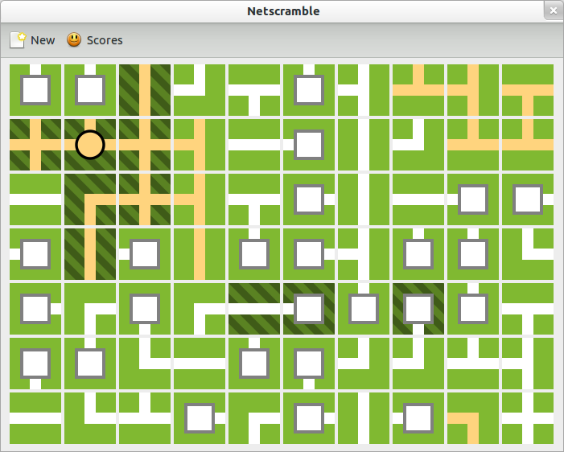

Netscramble
===========
Netscramble is a logic game similar to KNetWalk, implemented using Python, GTK, and Cairo. Currently only very basic functionality is implemented, but the game is playable. Left click to rotate tiles, and right click to lock them. Connect all the pipes from the rectangles to the the circle to win.

Install
-------
The dependencies are Python 2.7, Pycairo, and GObject introspection bindings for Gtk, GObject, and GLib. I have only tested on Ubuntu 12.10, which should have all of these.

Build a package and install:
::

 python setup.py sdist
 sudo pip install dist/netscramble-0.1.tar.gz

Run:
::

 netscramble

Uninstall:
::

 sudo pip uninstall netscramble

